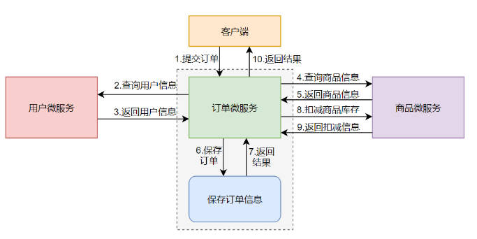

# shop-springcloud-alibaba
SpringCloud-alibaba 实战

##### 技术选型

* 持久层框架：Mybatis、Mybatis-Plus
* 微服务框架：SpringCloud Alibaba
* 消息中间件：RocketMQ
* 服务治理与服务配置：Nacos
* 负载均衡组件：Ribbon
* 远程服务调用：Feign
* 服务限流与容错：Sentinel
* 服务网关：SpringCloud-Gateway
* 服务链路追踪：Sleuth+ZipKin
* 分布式事务：Seata
* 数据存储：MySQL+ElasticSearch

##### 模块划分

* shop-springcloud-alibaba：Maven父工程。
* shop-bean：各服务都会使用的JavaBean模块，包含实体类、Dto、Vo等JavaBean。
* shop-utils：各服务都会使用的工具类模块。
* shop-order：订单微服务。
* shop-product：商品微服务。
* shop-user：用户微服务。

